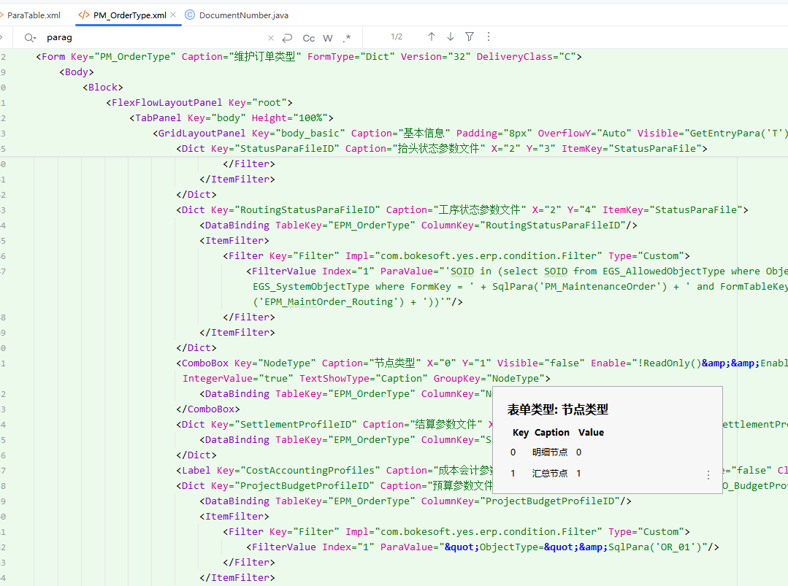
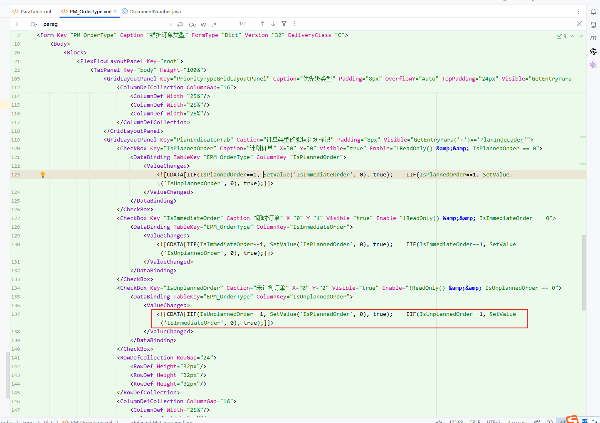
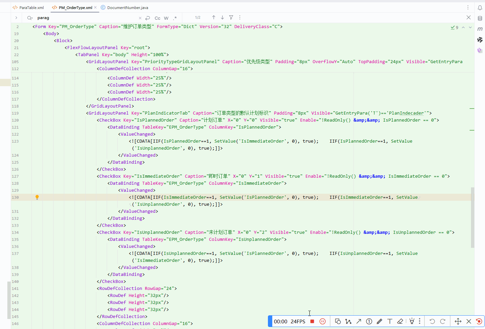
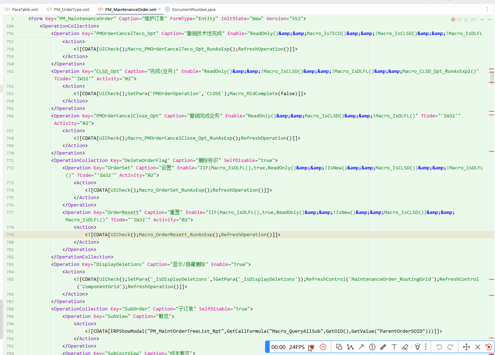

# yigo

## Template ToDo list
<!-- Plugin description -->
This Fancy IntelliJ Platform Plugin is going to be your implementation of the brilliant ideas that you have.

This specific section is a source for the [plugin.xml](/src/main/resources/META-INF/plugin.xml) file which will be extracted by the [Gradle](/build.gradle.kts) during the build process.

To keep everything working, do not remove `<!-- ... -->` sections. 
<!-- Plugin description end -->

## Installation

- Using the IDE built-in plugin system:
  
  <kbd>Settings/Preferences</kbd> > <kbd>Plugins</kbd> > <kbd>Marketplace</kbd> > <kbd>Search for "yigo"</kbd> >
  <kbd>Install</kbd>
  
- Using JetBrains Marketplace:

  Go to [JetBrains Marketplace](https://plugins.jetbrains.com/plugin/MARKETPLACE_ID) and install it by clicking the <kbd>Install to ...</kbd> button in case your IDE is running.

  You can also download the [latest release](https://plugins.jetbrains.com/plugin/MARKETPLACE_ID/versions) from JetBrains Marketplace and install it manually using
  <kbd>Settings/Preferences</kbd> > <kbd>Plugins</kbd> > <kbd>⚙️</kbd> > <kbd>Install plugin from disk...</kbd>

- Manually:

  Download the [latest release](https://github.com/believe-pxw/yigo/releases/latest) and install it manually using
  <kbd>Settings/Preferences</kbd> > <kbd>Plugins</kbd> > <kbd>⚙️</kbd> > <kbd>Install plugin from disk...</kbd>

---
Plugin based on the [IntelliJ Platform Plugin Template][template].

[template]: https://github.com/JetBrains/intellij-platform-plugin-template
[docs:plugin-description]: https://plugins.jetbrains.com/docs/intellij/plugin-user-experience.html#plugin-description-and-presentation

## 功能说明：

1. 支持光标浮动到groupkey上自动显示关联的值

2. CDATA中支持语法解析，高亮 字段，宏公式，java引用 还不完整

3. 支持公式中的字段，宏公式，java代码跳转

